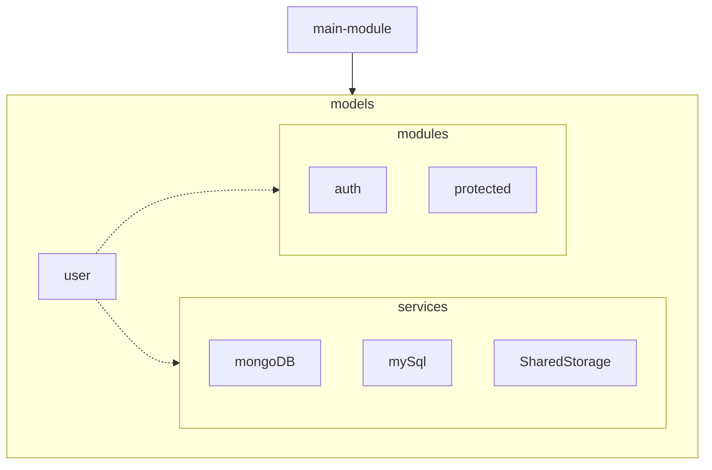

# JWT Authentication & DB templates in Flask
This repository contains source code template(s) for running micro webserver with both public and protected routes.

Authentication mechanism is `JWT` and webserver framework is `Flask`.

_Please note:_  
Some of the provided strategies are to basic/simple for **serious**, production level webserver.  
Use this template as starting point for more complex projects and requirements.

_**ENJOY !!**_

### JWT based
`JSON Web Tokens` - or [JWT](https://jwt.io/) in short - is the foundation authentication principle used in this template.  
Be sure **not to forget** to encode/decode token generation at your own strategy. Follow code comments for exact place where you could modify or customise this behaviour.

### Separate Database layer
DB layer has been split into separate `services` folder. It provides basic Python wrappers for `MySql` and `MongoDB` engines.  
In basic form, the code handles all authentication tokens **in memory**, making the data available only while the server is running. All registration data (as well as tokens) will disappear after the server shut down.  
For more convenient mechanism, store your tokens in some form of persistent storage, or reuse them in different way.

Data handling services supported so far:
1. `SharedStorage` (trivial implementation of in-memory storage)
2. `MySQL` wrapper
3. `MongoDB` wrapper

### Modularised
Template is designed to support modular structure. 
Following structure is used:


*NOTE:*
Main application modules are stored in `modules` folder. If you need more modules, you can place them inside - as long as they are connected to `main-module`. Customize your Flask bluperints further to support modularized approach you need.

### Different authentication strategies
Presented here is **basic** HTTP AUTHENTICATION through Authentication field. Note there are **way secure** authentication mechanisms, such as `OAuth`.

#### CORS setup
For the sake of simplicity, CORS has been enabled completely. Server will accept all origins no matter where the request comes from. Check and/or modify `@app.after_request` directive to further customise desired behaviour (lines [25-28](https://github.com/vexy/flask-auth-template/blob/master/main-module.py#L25-L28) in `main-module.py`).

### Installation
Before you begin:
```bash
git clone
cd flask-auth-template
```
Then proceed with installing dependencies:
```bash
# Run prepacked script
$ . install-dependencies.sh

# install manually through pip3
$ pip3 install -r requirements.txt

# or
python3.8 -m pip instal -r requirements.txt
```

### Starting server
Template will setup and start a server listening on `localhost`. Check the debug output for more information.  

Start the server using:
```bash
python3 main-module.py
# or
# run using startup script
$ . start.sh
```

**:NOTE:** for `MacOS` users:  
There might be a struggle with starting this project, due to known collision of `Python2.xx` and `Python3.xx` coexisting on same platform. The conflict might be manifested as good ol' *"Module Import Error"* no matter which Python you are using.
To solve this, you might have to "fix" (play around with) your `PYTHONPATH`.  Check out this [article](https://bic-berkeley.github.io/psych-214-fall-2016/using_pythonpath.html) for more information.

----
#### Word of wisdom
> If you ever get stuck remember that `sudo` is your friend. If it doesn't help, start thinking how one cold 🍺 can magically improve your understanding of the 🌎.  

----
MIT License

Copyright © 2020 Veljko Tekelerović  
PGP: `6302D860 B74CBD34 6482DBA2 518766D0 8213DBC0`  